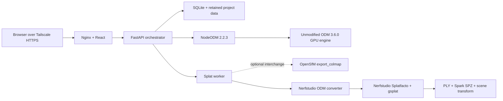

# Local Aerial Mapper

A private, single-user aerial mapping workstation for Ubuntu, OpenDroneMap, and one NVIDIA GPU. It keeps the stable ODM 3.6.0 processing engine intact, drives it through pinned NodeODM 2.2.3, and runs a separate Nerfstudio Splatfacto/gsplat stage after ODM releases the GPU.

The web app accepts drone imagery and supporting control files, retains every map until confirmed deletion, and presents orthomosaics, point clouds, textured models, DSM/DTM products, reports, raw artifacts, and Gaussian splats in one local interface. Recurring maps can be organized into one-level projects without moving or duplicating their retained data.

## What is included

- ODM v3.6.0 merged with full upstream history; `upstream` points to `OpenDroneMap/ODM`.
- NodeODM v2.2.3 vendored at its release commit under `vendor/nodeodm`.
- React/Vite workstation UI behind Nginx.
- FastAPI/SQLite orchestrator with one-time admin setup, Argon2id, secure sessions, CSRF protection, resumable uploads, SHA-256 validation, SSE, durable jobs, and allowlisted artifacts.
- One GPU queue: NodeODM completes before the Splatfacto worker can run.
- Memory-safe regular Splatfacto profiles for the 8 GB RTX 3060 Ti; `splatfacto-big` is not used.
- Reproducible splat stack pinned to Nerfstudio 1.1.5, gsplat 1.4.0, PyTorch 2.4.1, CUDA 12.4, and compute capability 8.6.
- OpenLayers raster maps, OGC 3D Tiles or LAS/LAZ 1.4 point clouds, Three.js
  OBJ/MTL/JPEG textured models with Draco GLB fallback, and Spark 2.1
  Gaussian-splat viewing.
- Local-only `127.0.0.1:8080` binding designed for Tailscale Serve.
- Optional anonymous, secret-link publishing through a separate read-only
  gateway and Cloudflare Tunnel at `dronemaps.ashersuter.com`.



When OpenSfM can produce its native binary COLMAP export, it is retained as an
interchange product. A failure in that optional exporter does not block splat
training. Training uses Nerfstudio's ODM converter because OpenSfM's calibrated
Brown camera model exports as `FULL_OPENCV`, which Nerfstudio 1.1.5's COLMAP
parser does not support.

## Target host

- Ubuntu 24.04
- GeForce RTX 3060 Ti with 8 GB VRAM
- 48 GB RAM
- Docker Engine with Compose v2
- Current NVIDIA driver and NVIDIA Container Toolkit
- SSD space sized for source data plus multiple dense reconstructions

The ODM GPU image is pinned to CUDA 12.9.1 because OpenMVS in ODM 3.6.0 is not
compatible with the CUDA 13 header removals. A newer host driver is supported:
the NVIDIA driver only needs to be new enough to run the container's CUDA
12.9.1 runtime.

## Install

1. Install Docker Engine, the current NVIDIA driver, and
   [NVIDIA Container Toolkit](https://docs.nvidia.com/datacenter/cloud-native/container-toolkit/latest/install-guide.html).
   Configure Docker as an NVIDIA runtime and restart it:

   ```bash
   sudo nvidia-ctk runtime configure --runtime=docker
   sudo systemctl restart docker
   ```

   `nvidia-persistenced.service` is a static helper unit on many Ubuntu
   installations, so do not try to enable it. The host preflight only requires
   it to be running when the installed NVIDIA runtime configuration explicitly
   mounts its socket. If a generated CDI specification is stale, the preflight
   identifies the exact file and prints the NVIDIA-supported refresh commands.
2. Clone this repository with submodules, which ODM itself uses:

   ```bash
   git clone --recurse-submodules https://github.com/araysuter/3Ddrone.git
   cd 3Ddrone
   ```

3. Create the runtime configuration and retained data directory:

   ```bash
   cp .env.example .env
   sudo mkdir -p /srv/local-aerial-mapper
   sudo chown "$USER":"$USER" /srv/local-aerial-mapper
   openssl rand -hex 32
   openssl rand -hex 32
   ```

   Put the two different generated values into `NODEODM_TOKEN` and
   `MAPPER_INTERNAL_TOKEN` in `.env`. Set `MAPPER_UID` and `MAPPER_GID` to the
   output of `id -u` and `id -g` for the account that owns the data directory.

4. Validate the configuration, build the pinned images, run the host/GPU
   preflight, start the services, and wait for health:

   ```bash
   make up
   ```

   The first ODM and Splatfacto builds download and compile large CUDA stacks
   and can take a substantial amount of time. The Splatfacto build also caches
   its LPIPS/AlexNet metric weights so jobs do not need runtime internet. Later
   starts reuse the pinned ODM image even when application code changes. Use
   `make rebuild-odm` only after intentionally changing ODM or `gpu.Dockerfile`.

5. Verify local health and GPU visibility:

   ```bash
   curl --fail http://127.0.0.1:8080/api/health
   make gpu-smoke
   ```

6. Publish it only to the tailnet with TLS:

   ```bash
   sudo tailscale serve --bg http://127.0.0.1:8080
   tailscale serve status
   ```

   Keep tailnet ACLs limited to the intended user. Do not use Tailscale Funnel.

Open the HTTPS URL reported by Tailscale, create the one local administrator, and upload a small test project first.

## Mapping behavior

The default High profile requests 2.5 cm raster resolution, high point-cloud density, and 30,000 regular Splatfacto steps. Standard requests 5 cm and 15,000 steps. Ultra requests 1 cm and 45,000 steps. ODM still caps outputs by its estimated ground sampling distance; the application never enables `ignore-gsd`.

ODM edge cropping is disabled by default with `crop=0`, so reconstructed coverage is not trimmed merely because it lies near the mapping boundary. The Advanced drawer can override that value when a deliberately cropped deliverable is desired.

FC330 captures automatically receive ODM’s known 33 ms rolling-shutter correction. Litchi `.lchm` files are retained as provenance but are never submitted as reconstruction inputs. Accepted imagery is JPG/JPEG, DNG, TIF/TIFF, MP4, MOV, LRV, or MPEG transport-stream video. The supported control inputs are `gcp_list.txt`, `geo.txt`, `image_groups.txt`, `align.las`, `align.laz`, `align.tif`, and SRT subtitle telemetry.

Consumer drone GPS is labeled “best effort,” not survey grade. Measurements use the project coordinate reference system when georeferenced products are available. Supplying GCPs changes the label to “GCP-assisted,” but the quality report and control residuals remain authoritative.

Use **Map actions → Rename map** to change a map's display name without
reprocessing it or moving retained files. Existing public share headers are
updated to the new name while their published result files remain unchanged.

Completed, partial, failed, and canceled maps with retained imagery can be
queued again from **Map actions → Reprocess with different settings**. The
dialog reuses the original uploads and lets the operator change the preset,
outputs, and allowlisted Advanced values. Existing local results stay available
until the replacement NodeODM archive has been downloaded and validated.

The UI calls each processed dataset a **Map** and uses **Projects** as optional
organizational folders for repeated captures of the same site. Existing maps
remain under **No Project** after upgrading. Moving a map or deleting its
project changes only SQLite metadata; deleting a project moves its maps back to
No Project and never removes source imagery or artifacts.

Completed and partial maps can be published from the rightmost **Share** button
in the results toolbar. Each map has one stable, revocable secret link. The
public page shows the assigned Project above the map name and exposes only the
published viewers and downloads—never setup, uploads, processing, reprocessing,
map deletion, or the local operator API. A completed replacement is published
atomically after reprocessing; visitors continue seeing the prior published
result while a new run is incomplete. Public sharing is off by default; follow
[Operations and recovery](docs/OPERATIONS.md#public-read-only-sharing) to
configure the dedicated Cloudflare Tunnel.

## Development

Backend:

```bash
PYTHONPATH=services/api services/api/.venv/bin/pytest -q services/api/tests
```

Frontend:

```bash
npm --prefix frontend install
npm --prefix frontend run lint
npm --prefix frontend run build
```

For UI-only processing flows without a GPU:

```bash
make demo
curl --fail http://127.0.0.1:8080/api/health
```

Demo mode starts only the API and frontend, requires no CUDA host, and never
represents a reconstruction as real output.

## Documentation

- [Operations and recovery](docs/OPERATIONS.md)
- [Architecture and data contracts](docs/ARCHITECTURE.md)
- [GPU and sample acceptance checklist](docs/ACCEPTANCE.md)
- [Local modifications](MODIFICATIONS.md)
- [Third-party notices](THIRD_PARTY_NOTICES.md)
- [Original ODM README](docs/upstream/ODM-README.md)
- [NodeODM API documentation](vendor/nodeodm/docs/index.adoc)

## License and warranty

This repository is licensed under AGPLv3. Network users must be offered the corresponding source, including local modifications. See [LICENSE](LICENSE), [MODIFICATIONS.md](MODIFICATIONS.md), and [THIRD_PARTY_NOTICES.md](THIRD_PARTY_NOTICES.md).

The software and its outputs are provided without warranty. Nothing in the UI certifies survey accuracy, legal boundaries, or fitness for engineering decisions.
