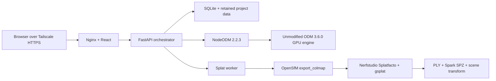

# Local Aerial Mapper

A private, single-user aerial mapping workstation for Ubuntu, OpenDroneMap, and one NVIDIA GPU. It keeps the stable ODM 3.6.0 processing engine intact, drives it through pinned NodeODM 2.2.3, and runs a separate Nerfstudio Splatfacto/gsplat stage after ODM releases the GPU.

The web app accepts drone imagery and supporting control files, retains every project until confirmed deletion, and presents orthomosaics, point clouds, textured models, DSM/DTM products, reports, raw artifacts, and Gaussian splats in one local interface.

## What is included

- ODM v3.6.0 merged with full upstream history; `upstream` points to `OpenDroneMap/ODM`.
- NodeODM v2.2.3 vendored at its release commit under `vendor/nodeodm`.
- React/Vite workstation UI behind Nginx.
- FastAPI/SQLite orchestrator with one-time admin setup, Argon2id, secure sessions, CSRF protection, resumable uploads, SHA-256 validation, SSE, durable jobs, and allowlisted artifacts.
- One GPU queue: NodeODM completes before the Splatfacto worker can run.
- Memory-safe regular Splatfacto profiles for the 8 GB RTX 3060 Ti; `splatfacto-big` is not used.
- OpenLayers, the NodeODM Potree output, Three.js, and Spark 2.1 viewers.
- Local-only `127.0.0.1:8080` binding designed for Tailscale Serve.



## Target host

- Ubuntu 24.04
- GeForce RTX 3060 Ti with 8 GB VRAM
- 48 GB RAM
- Docker Engine with Compose v2
- Current NVIDIA driver and NVIDIA Container Toolkit
- SSD space sized for source data plus multiple dense reconstructions

The pinned upstream ODM GPU Dockerfile currently builds on CUDA 13.0. Confirm the installed driver supports that runtime before starting the long build.

## Install

1. Install Docker Engine, the current NVIDIA driver, and [NVIDIA Container Toolkit](https://docs.nvidia.com/datacenter/cloud-native/container-toolkit/latest/install-guide.html).
2. Clone this repository with submodules, which ODM itself uses:

   ```bash
   git clone --recurse-submodules https://github.com/araysuter/3Ddrone.git
   cd 3Ddrone
   ```

3. Create the runtime configuration and retained data directory:

   ```bash
   cp .env.example .env
   sudo mkdir -p /srv/local-aerial-mapper
   sudo chown "$USER":"$USER" /srv/local-aerial-mapper
   openssl rand -hex 32
   openssl rand -hex 32
   ```

   Put the two different generated values into `NODEODM_TOKEN` and `MAPPER_INTERNAL_TOKEN` in `.env`.

4. Build the pinned ODM base first, then the four application services:

   ```bash
   make build
   make up
   ```

5. Verify local health and GPU visibility:

   ```bash
   curl --fail http://127.0.0.1:8080/api/health
   make gpu-smoke
   ```

6. Publish it only to the tailnet with TLS:

   ```bash
   sudo tailscale serve --bg http://127.0.0.1:8080
   tailscale serve status
   ```

   Keep tailnet ACLs limited to the intended user. Do not use Tailscale Funnel.

Open the HTTPS URL reported by Tailscale, create the one local administrator, and upload a small test project first.

## Mapping behavior

The default High profile requests 2.5 cm raster resolution, high point-cloud density, and 30,000 regular Splatfacto steps. Standard requests 5 cm and 15,000 steps. Ultra requests 1 cm and 45,000 steps. ODM still caps outputs by its estimated ground sampling distance; the application never enables `ignore-gsd`.

FC330 captures automatically receive ODM’s known 33 ms rolling-shutter correction. Litchi `.lchm` files are retained as provenance but are never submitted as reconstruction inputs. JPG, DNG, TIFF, supported video, GCP, GEO, image-group, and alignment files can be submitted.

Consumer drone GPS is labeled “best effort,” not survey grade. Measurements use the project coordinate reference system when georeferenced products are available. Supplying GCPs changes the label to “GCP-assisted,” but the quality report and control residuals remain authoritative.

## Development

Backend:

```bash
PYTHONPATH=services/api services/api/.venv/bin/pytest -q services/api/tests
```

Frontend:

```bash
npm --prefix frontend install
npm --prefix frontend run build
```

For UI-only processing flows without a GPU:

```bash
docker compose -f compose.yaml -f compose.demo.yaml up -d --build
```

Demo mode never represents a reconstruction as real output.

## Documentation

- [Operations and recovery](docs/OPERATIONS.md)
- [Architecture and data contracts](docs/ARCHITECTURE.md)
- [GPU and sample acceptance checklist](docs/ACCEPTANCE.md)
- [Local modifications](MODIFICATIONS.md)
- [Third-party notices](THIRD_PARTY_NOTICES.md)
- [Original ODM README](docs/upstream/ODM-README.md)
- [NodeODM API documentation](vendor/nodeodm/docs/index.adoc)

## License and warranty

This repository is licensed under AGPLv3. Network users must be offered the corresponding source, including local modifications. See [LICENSE](LICENSE), [MODIFICATIONS.md](MODIFICATIONS.md), and [THIRD_PARTY_NOTICES.md](THIRD_PARTY_NOTICES.md).

The software and its outputs are provided without warranty. Nothing in the UI certifies survey accuracy, legal boundaries, or fitness for engineering decisions.
