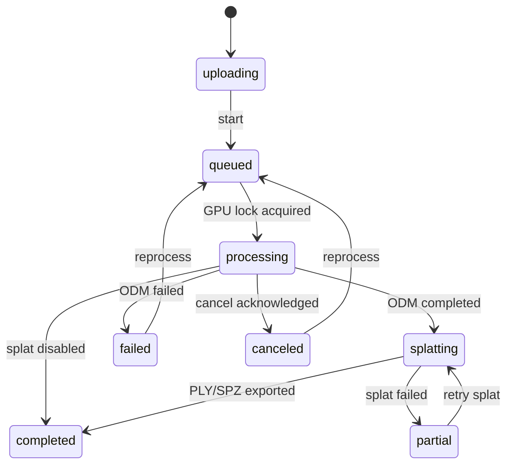

# Architecture and data contracts

## Runtime boundaries

Only Nginx binds a host port, and it binds `127.0.0.1:8080`. Nginx joins the
edge and internal networks; the API, NodeODM, and splat worker join only the
Docker `internal: true` network. NodeODM also requires its own random token; the
splat worker requires a different internal token. The browser never receives
either service token.

The optional `sharing` profile adds `public-gateway` and `cloudflared`.
Cloudflared joins only `mapper-public`; it cannot address the API, NodeODM, or
splat worker. The public Nginx gateway joins `mapper-public` and
`mapper-internal`, serves a public-only Vite build, and proxies only
`/api/public/about` plus scoped read-only share routes. It returns 404 for the
operator API. The private frontend and its `127.0.0.1:8080` binding do not join
the public network.

The public Vite entry renders the same `ResultsView` and `MapViewer` components
as the operator UI. Each viewer receives an explicit resource base URL, so
private maps, individual public maps, and maps nested inside public Projects
share one renderer without deriving access scope from an internal map ID.
Inspect, Distance, Area, measurement units, labels, Escape behavior, and Clear
remain one shared implementation across private and recipient-facing views.
The shared raster viewer also owns one optional OpenStreetMap layer beneath the
ODM raster. It is constructed hidden and resets off for every map or raster
view, so no third-party tile request occurs without a deliberate Basemap
button press. Private and public Nginx policies allow only the OSM tile
hostname for external images; each tile request sends only the page origin as
its referrer while the app's global `no-referrer` policy remains unchanged.
OpenLayers displays the source attribution only while the external layer is
visible.

The API owns processing-map state. The legacy `projects` table and
`/api/projects` routes continue to represent individual maps for compatibility;
the UI's one-level Projects are stored separately in `map_folders`. NodeODM
remains authoritative for ODM task progress and console output. The API uses
only NodeODM’s initialize/upload/commit, info, output, cancel, restart, remove,
options, and `all.zip` download routes. It does not mutate NodeODM task
directories.

All long-running containers drop Linux capabilities and enable
`no-new-privileges`. Nginx uses its unprivileged image, while API and worker
processes run as the configured non-root UID/GID. The one-shot data initializer
has no network, a read-only root filesystem, and only the three capabilities
needed to create/chown retained directories. NodeODM application code remains
owned by root; only its task, temp, and rotating-log directories are writable
by its service user.

## Durable data layout

`MAPPER_DATA_DIR` is mounted at `/data` in the API and splat worker:

```text
source/<project UUID>/       Validated originals and support files
nodeodm/<task UUID>/         NodeODM-owned durable task state
splat/jobs/                  Durable splat job records
splat/work/<project UUID>/   Optional COLMAP export, ODM conversion, checkpoints, and recovery state
metadata/mapper.sqlite3      Users, sessions, maps, folders, uploads, and SSE events
metadata/projects/<UUID>/    Extracted allowlisted artifacts and all.zip
metadata/shares/<UUID>/      Hard-linked, versioned public result snapshots
metadata/folder-shares/<UUID>/items/<UUID>/versions/<version>/
                             Hard-linked public Project map snapshots
logs/nodeodm/                NodeODM logs
uploads/                     Incomplete resumable parts
```

Deleting a map requires its exact name in `X-Confirm-Project-Name`. The API
rejects map deletion while processing is active. Deleting a map folder requires
`X-Confirm-Folder-Name`; the transaction assigns its maps to No Project before
removing only the folder row. No background retention policy removes completed
map data.

Map folders contain only an ID, a case-insensitively unique display name, and
timestamps. `projects.folder_id` is nullable with `ON DELETE SET NULL`. Moving
an active or completed map between folders does not change its job, upload,
artifact, or event records.

## Public sharing

`project_shares` stores one random UUID bearer ID per map, its enabled state,
aggregate page-view count, last-viewed time, and the active snapshot version.
Anyone with the public URL can read the published snapshot without signing in
or receiving a browser cookie. Disabling a link checks the database on every
request. Regeneration replaces the UUID and moves the immutable publication to
the new share root so the old URL immediately fails.

Publication creates a new immutable hard-link tree from the currently
allowlisted artifact set and atomically points the share row to it. Reprocessing
does not modify that tree. Only a newly completed map replaces the public
snapshot, after which the old version is removed. Public responses are
`private, no-store`, carry `X-Robots-Tag: noindex`, and contain a sanitized
project snapshot without internal task IDs, paths, errors, uploads, source
metadata, advanced settings, or service state.

`folder_shares` stores one random UUID bearer ID per named Project, plus its
enabled state, generation, and collection page-view metrics.
`folder_share_items` assigns a separate random public item UUID to each
published map and records its active immutable snapshot. Public Project payloads
contain only the Project display name, public item IDs, sanitized map metadata,
and allowlisted artifacts. They never expose `map_folders.id`, internal
`projects.id`, processing errors, uploads, paths, advanced settings, or service
state.

Project membership is reconciled live. Completed maps publish a new version
atomically. A first usable partial result may publish, while a partial or failed
replacement preserves the prior snapshot and records an owner-visible
publication issue. Moving or deleting a map removes its old Project item;
moving an eligible map into a shared Project publishes it. Deleting the named
Project revokes its link and removes its publication tree. Disabling preserves
snapshots but makes collection and nested-map endpoints unavailable. Replacing
the link updates the UUID with cascading item ownership, moves the snapshot
root, and resets collection metrics so every old URL fails immediately.

Individual public routes are `/share/maps/{shareUuid}` backed by
`/api/public/map-shares/{shareUuid}`. Project routes are
`/share/projects/{shareUuid}` and
`/share/projects/{shareUuid}/maps/{itemUuid}`, backed by the scoped
`/api/public/project-shares/...` namespace. The legacy `/share/{uuid}` and
`/api/public/shares/{uuid}` surfaces are intentionally not routed.

NodeODM receives an effectively non-expiring task retention value because
upstream interprets zero as immediate deletion. Its temporary, uncommitted
uploads are still cleaned after seven days. Docker JSON logs and NodeODM file
logs rotate to bound routine log growth.

## Project state machine



There is one API job-runner task and NodeODM is configured with `parallelQueueProcessing=1`. The runner waits for ODM completion before it submits a splat job, so the two GPU-heavy workloads cannot overlap.

The splat image preloads Splatfacto's LPIPS/AlexNet metric weights into
`/opt/torch-cache` while the image is built. The running worker remains on the
internal network and does not need DNS or internet access to initialize
training.

Before uploading, the API reserves a UUID and sends it through NodeODM's
standard `Set-UUID` field. This makes a lost commit response recoverable: the
same durable UUID is polled rather than creating an ambiguous duplicate task.
Uncommitted temporary uploads are safe to retry and are eventually removed by
NodeODM. NodeODM's initialize endpoint accepts its fields as
`multipart/form-data`; immediately after commit, the API compares every
requested option with the effective task options and cancels the task if any
setting was silently dropped or changed.

On API restart, queued, processing, or splatting projects are reconciled.
Existing NodeODM UUIDs are polled instead of re-uploaded. Transient NodeODM and
splat polling failures use bounded retries rather than immediately failing a
project. The splat worker changes an interrupted `running` job back to `queued`,
reuses the OpenSfM data, optional COLMAP interchange output, and
ODM-to-Nerfstudio conversion, then resumes from the newest Nerfstudio
config/checkpoint when one exists. The native COLMAP exporter is nonblocking
because training consumes Nerfstudio's ODM conversion directly. Final splat
products are validated, fsynced, and atomically published so an interrupted
export cannot replace a prior good result with a partial one.

If OpenMVS fails while cleaning ODM's full 3D Poisson mesh, the orchestrator
uses NodeODM's standard restart API once with `skip-3dmodel`. ODM reuses its
completed reconstruction and produces the normal 2.5D textured terrain mesh,
orthophoto, elevation, point-cloud, report, and camera outputs. The terrain OBJ
and GLB are packaged and exposed under their actual `odm_texturing_25d` paths.
Any second mesh failure remains a failed project rather than entering a retry
loop.

## Intake

The browser uploads 5 MiB chunks with three-file concurrency and computes
incremental SHA-256 digests without buffering whole files. It stores the server
upload UUID locally, queries `HEAD /api/uploads/{id}` after a connection loss,
and resumes from the server offset. The server serializes concurrent chunks,
reconciles the database offset with the on-disk part, and requires a matching
digest. After the final rename, `HEAD` can recover the narrow crash window in
which the validated file exists but the database completion transaction did
not finish.

The server enforces filename, file-size, project-size, disk-reserve, signature,
image-dimension, and duplicate-hash limits before atomically retaining a
source. Missing validated sources cause inspection or processing to fail
explicitly rather than silently producing an incomplete map.

EXIF and DJI XMP are read with ExifTool in the container. FC330 is mapped to the ODM rolling-shutter database profile and an explicit 33 ms readout. `.lchm` is provenance only.

## Outputs and viewers

The API sends NodeODM an explicit archive path list derived from the project's
output selections. NodeODM's legacy post-processing layer is disabled so it
cannot silently re-enable COG, GLB, or EPT exports; ODM 3.6 receives the
selected native options directly. The API downloads the resulting `all.zip`
over NodeODM’s public API, fsyncs and validates the ZIP, limits entry count and
expanded size, rejects traversal, symlinks, and duplicate paths, extracts
atomically under the project artifact directory, and builds a canonical
server-side allowlist. Artifact discovery and viewer routes apply the same
selection again, so stale files from an earlier run cannot expose a disabled
product.

- Orthomosaic/DSM/DTM: OpenLayers and local static tiles, with an optional
  off-by-default OpenStreetMap layer beneath them.
- Point cloud: generated OGC 3D Tiles are preferred, followed by coarse-first
  EPT hierarchy streaming. The monolithic LAS/LAZ 1.4 fallback is decoded in
  bounded chunks by a Rust/WASM worker, with a six-million-point display budget,
  so decompression and coordinate conversion do not block the UI.
- Textured mesh: the API derives a browser preview from ODM's Draco-capable GLB
  without changing its geometry, resizing embedded texture atlases to a
  GPU-safe maximum of 1024 px. New projects build it during artifact install;
  the durable worker backfills existing projects and republishes their active
  shares. The preview is preferred because it provides one substantially
  smaller, measurable download with photographic color and a percentage bar.
  OGC 3D Tiles provide progressive color while a preview is unavailable, with
  the original GLB and ODM's authoritative OBJ/MTL/JPEG package as fallbacks.
- Three-dimensional viewers share ground-anchored navigation. Point-cloud
  orbit can pitch from near-overhead to the ground horizon but cannot cross
  below the ground plane. Wheel zoom uses a constant world-space step without
  a practical distance cap. Right-button or held-scroll-wheel dragging pans at
  a constant world-space rate rather than scaling with camera distance.
  Interaction stays locked while point-cloud detail is streaming, including
  each adaptive 3D Tiles loading pass, so late data cannot invalidate an
  in-progress camera gesture. Viewer failure handlers keep stable identities so
  operator metadata polling and public-view rerenders do not tear down and
  restart active EPT or 3D Tiles streams.
- Gaussian splat: Spark 2.1 loads SPZ or PLY, reports streaming progress, and
  fits the camera to the decoded Gaussian bounds after initialization.
- Report: same-origin embedded PDF.
- Elevation: raster sample in the project CRS using Rasterio.

Turning off a product removes its viewer, download entries, archive paths, and
ODM export flags where ODM provides one. Some reconstruction stages are shared:
feature matching and dense reconstruction are prerequisites for mapped
products, and ODM creates an internal 2.5D terrain surface for raster products
even when the exported 3D model is disabled. Gaussian splatting is independent
and is never submitted when its output switch is off.

Measurement tools calculate project-CRS distance and area. Fixed-pixel map
labels show polyline totals, polygon side lengths, and polygon area without
replacing the coordinate toolbar; viewers can switch between a persisted
imperial default and metric units in authenticated or public-share views.
Consumer GPS is always labeled best effort. GCP-assisted projects still
require report review; the app does not promote them to certified survey
grade.

The Advanced drawer is populated from the running NodeODM option metadata, but
the server exposes only a small typed allowlist. Arbitrary paths, clusters,
stage reruns, copied task state, and resource/GSD bypass options never reach
NodeODM.
