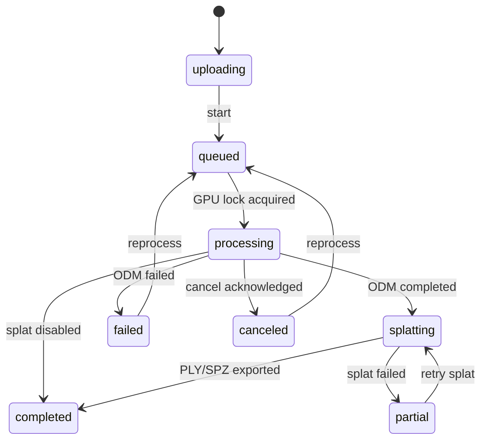

# Architecture and data contracts

## Runtime boundaries

Only Nginx binds a host port, and it binds `127.0.0.1:8080`. The API, NodeODM, and splat worker live on a Docker internal network. NodeODM also requires its own random token; the splat worker requires a different internal token. The browser never receives either service token.

The API owns project state. NodeODM remains authoritative for ODM task progress and console output. The API uses only NodeODM’s initialize/upload/commit, info, output, cancel, restart, remove, options, and `all.zip` download routes. It does not mutate NodeODM task directories.

## Durable data layout

`MAPPER_DATA_DIR` is mounted at `/data` in the API and splat worker:

```text
source/<project UUID>/       Validated originals and support files
nodeodm/<task UUID>/         NodeODM-owned durable task state
splat/jobs/                  Durable splat job records
splat/work/<project UUID>/   COLMAP export, checkpoints, and recovery state
metadata/mapper.sqlite3      Users, sessions, projects, uploads, and SSE events
metadata/projects/<UUID>/    Extracted allowlisted artifacts and all.zip
logs/nodeodm/                NodeODM logs
uploads/                     Incomplete resumable parts
```

Deleting a project requires the exact project name in `X-Confirm-Project-Name`. The API rejects deletion while the project is active. No background retention policy removes completed project data.

## Project state machine



There is one API job-runner task and NodeODM is configured with `parallelQueueProcessing=1`. The runner waits for ODM completion before it submits a splat job, so the two GPU-heavy workloads cannot overlap.

On API restart, queued, processing, or splatting projects are reconciled. Existing NodeODM UUIDs are polled instead of re-uploaded. The splat worker changes an interrupted `running` job back to `queued`, reuses the OpenSfM/COLMAP conversion, and resumes from the newest Nerfstudio config/checkpoint when one exists.

## Intake

The browser uploads 5 MiB chunks with three-file concurrency. It stores the server upload UUID locally, queries `HEAD /api/uploads/{id}` after a connection loss, and resumes from the server offset. Completion requires a matching SHA-256 digest. The server validates file signatures and image readability, rejects duplicate hashes within a project, and then atomically moves the part into retained source storage.

EXIF and DJI XMP are read with ExifTool in the container. FC330 is mapped to the ODM rolling-shutter database profile and an explicit 33 ms readout. `.lchm` is provenance only.

## Outputs and viewers

NodeODM packages default useful products plus the full OpenSfM working output. The API downloads `all.zip` over NodeODM’s public API, checks every ZIP member against path traversal, extracts it under the project artifact directory, and builds a server-side allowlist.

- Orthomosaic/DSM/DTM: OpenLayers and local static tiles.
- Point cloud: NodeODM’s generated Potree viewer/EPT output.
- Textured mesh: Three.js GLB viewer; OBJ and 3D Tiles remain downloadable.
- Gaussian splat: Spark 2.1 loads SPZ or PLY.
- Report: same-origin embedded PDF.
- Elevation: raster sample in the project CRS using Rasterio.

Measurement tools display project-CRS distance and area. Consumer GPS is always labeled best effort. GCP-assisted projects still require report review; the app does not promote them to certified survey grade.
