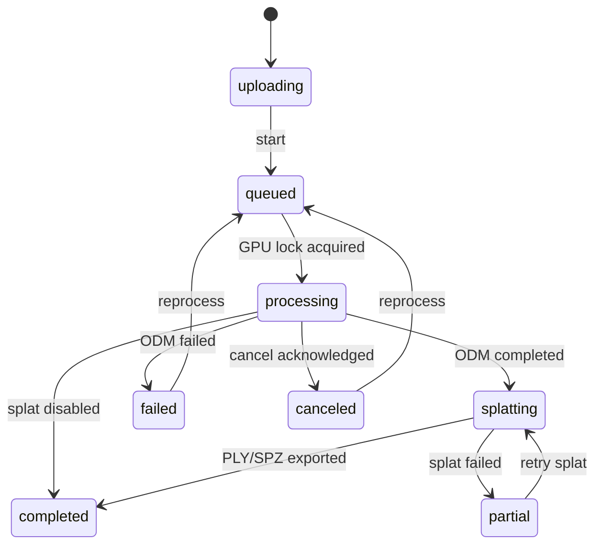

# Architecture and data contracts

## Runtime boundaries

Only Nginx binds a host port, and it binds `127.0.0.1:8080`. Nginx joins the
edge and internal networks; the API, NodeODM, and splat worker join only the
Docker `internal: true` network. NodeODM also requires its own random token; the
splat worker requires a different internal token. The browser never receives
either service token.

The API owns project state. NodeODM remains authoritative for ODM task progress and console output. The API uses only NodeODM’s initialize/upload/commit, info, output, cancel, restart, remove, options, and `all.zip` download routes. It does not mutate NodeODM task directories.

All long-running containers drop Linux capabilities and enable
`no-new-privileges`. Nginx uses its unprivileged image, while API and worker
processes run as the configured non-root UID/GID. The one-shot data initializer
has no network, a read-only root filesystem, and only the three capabilities
needed to create/chown retained directories. NodeODM application code remains
owned by root; only its task, temp, and rotating-log directories are writable
by its service user.

## Durable data layout

`MAPPER_DATA_DIR` is mounted at `/data` in the API and splat worker:

```text
source/<project UUID>/       Validated originals and support files
nodeodm/<task UUID>/         NodeODM-owned durable task state
splat/jobs/                  Durable splat job records
splat/work/<project UUID>/   COLMAP export, ODM conversion, checkpoints, and recovery state
metadata/mapper.sqlite3      Users, sessions, projects, uploads, and SSE events
metadata/projects/<UUID>/    Extracted allowlisted artifacts and all.zip
logs/nodeodm/                NodeODM logs
uploads/                     Incomplete resumable parts
```

Deleting a project requires the exact project name in `X-Confirm-Project-Name`. The API rejects deletion while the project is active. No background retention policy removes completed project data.

NodeODM receives an effectively non-expiring task retention value because
upstream interprets zero as immediate deletion. Its temporary, uncommitted
uploads are still cleaned after seven days. Docker JSON logs and NodeODM file
logs rotate to bound routine log growth.

## Project state machine



There is one API job-runner task and NodeODM is configured with `parallelQueueProcessing=1`. The runner waits for ODM completion before it submits a splat job, so the two GPU-heavy workloads cannot overlap.

Before uploading, the API reserves a UUID and sends it through NodeODM's
standard `Set-UUID` field. This makes a lost commit response recoverable: the
same durable UUID is polled rather than creating an ambiguous duplicate task.
Uncommitted temporary uploads are safe to retry and are eventually removed by
NodeODM.

On API restart, queued, processing, or splatting projects are reconciled.
Existing NodeODM UUIDs are polled instead of re-uploaded. Transient NodeODM and
splat polling failures use bounded retries rather than immediately failing a
project. The splat worker changes an interrupted `running` job back to `queued`,
reuses the OpenSfM/COLMAP and ODM-to-Nerfstudio conversions, and resumes from
the newest Nerfstudio config/checkpoint when one exists. Final splat products
are validated, fsynced, and atomically published so an interrupted export
cannot replace a prior good result with a partial one.

## Intake

The browser uploads 5 MiB chunks with three-file concurrency and computes
incremental SHA-256 digests without buffering whole files. It stores the server
upload UUID locally, queries `HEAD /api/uploads/{id}` after a connection loss,
and resumes from the server offset. The server serializes concurrent chunks,
reconciles the database offset with the on-disk part, and requires a matching
digest. After the final rename, `HEAD` can recover the narrow crash window in
which the validated file exists but the database completion transaction did
not finish.

The server enforces filename, file-size, project-size, disk-reserve, signature,
image-dimension, and duplicate-hash limits before atomically retaining a
source. Missing validated sources cause inspection or processing to fail
explicitly rather than silently producing an incomplete map.

EXIF and DJI XMP are read with ExifTool in the container. FC330 is mapped to the ODM rolling-shutter database profile and an explicit 33 ms readout. `.lchm` is provenance only.

## Outputs and viewers

NodeODM packages default useful products plus images and the full OpenSfM
working output. The API downloads `all.zip` over NodeODM’s public API, fsyncs
and validates the ZIP, limits entry count and expanded size, rejects traversal,
symlinks, and duplicate paths, extracts atomically under the project artifact
directory, and builds a canonical server-side allowlist.

- Orthomosaic/DSM/DTM: OpenLayers and local static tiles.
- Point cloud: generated Potree/EPT when present, with OGC 3D Tiles as the
  current ODM fallback.
- Textured mesh: Three.js GLB or OGC 3D Tiles viewer; OBJ remains downloadable.
- Gaussian splat: Spark 2.1 loads SPZ or PLY.
- Report: same-origin embedded PDF.
- Elevation: raster sample in the project CRS using Rasterio.

Measurement tools display project-CRS distance and area. Consumer GPS is always labeled best effort. GCP-assisted projects still require report review; the app does not promote them to certified survey grade.

The Advanced drawer is populated from the running NodeODM option metadata, but
the server exposes only a small typed allowlist. Arbitrary paths, clusters,
stage reruns, copied task state, and resource/GSD bypass options never reach
NodeODM.
